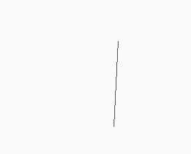
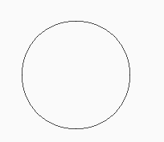
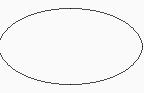
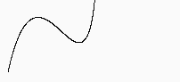
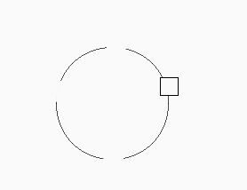

# Computer Graphics HW1

## 1. Completed Tasks

I have implemented the following drawing algorithms in this assignment:

* ✅ **Line Drawing Algorithm** — Implemented using the **Bresenham line algorithm**.
* ✅ **Circle Drawing Algorithm** — Implemented using the **Midpoint circle algorithm**.
* ✅ **Ellipse Drawing Algorithm** — Implemented using the **Midpoint ellipse algorithm**.
* ✅ **Bezier Curve Drawing** — Implemented using the **Cubic Bézier curve equation**.
* ✅ **Eraser Tool** — Implemented using rectangular area clearing.

---

## 2. Screenshots of My Work

*(Screenshots will be inserted here after testing)*

| Feature         | Screenshot                                 |
| :-------------- | :----------------------------------------- |
| Line Drawing    | ![line result]       |
| Circle Drawing  | ![circle result]   |
| Ellipse Drawing | ![ellipse result] |
| Bézier Curve    | ![curve result]     |
| Eraser          | ![eraser result]   |

---

## 3. Explanation of Implemented Algorithms

### **1. Line Drawing (`CGLine`)**

The **Bresenham line algorithm** was implemented to efficiently determine which pixels should be drawn to form a straight line between `(x1, y1)` and `(x2, y2)`.

Key idea:

* We increment either `x` or `y` depending on the line slope.
* The **decision variable `d`** determines when to change the secondary coordinate.
* The algorithm handles all **eight octants** by using `sx` and `sy` for direction.

```java
float dx = abs(x2 - x1);
float dy = abs(y2 - y1);
int sx = x2 > x1 ? 1 : -1;
int sy = y2 > y1 ? 1 : -1;
boolean in45 = dx > dy;

if (in45) {
    float d = dy - (dx / 2);
    while (x2 != x) {
        drawPoint(x, y, 0);
        if (d < 0) d += dy;
        else { d += dy - dx; y += sy; }
        x += sx;
    }
}
```

---

### **2. Circle Drawing (`CGCircle`)**

Implemented using the **Midpoint Circle Algorithm**.
Only one octant is computed; other points are reflected to cover the entire circle.

Key idea:

* Use a decision variable `d = 1 - r`. (Normally its 1.25 , but i believe that 1-r behaves almost the same way)
* If `d > 0`, move diagonally; otherwise, move horizontally.
* This avoids floating-point operations and uses symmetry for efficiency.

```java
int sx = 0, sy = (int)r;
int d = 1 - (int)r;

while (sx <= sy) {
    // Draw 8 symmetrical points
    drawPoint(x + sx, y + sy, 0);
    drawPoint(x - sx, y + sy, 0);
    drawPoint(x + sx, y - sy, 0);
    drawPoint(x - sx, y - sy, 0);
    drawPoint(x + sy, y + sx, 0);
    drawPoint(x - sy, y + sx, 0);
    drawPoint(x + sy, y - sx, 0);
    drawPoint(x - sy, y - sx, 0);

    if (d > 0) {
        sy--;
        d += 2 * (sx - sy) + 1;
    } else {
        d += 2 * sx + 1;
    }
    sx++;
}
```

---

### **3. Ellipse Drawing (`CGEllipse`)**

Implemented using the **Midpoint Ellipse Algorithm**, which divides the drawing process into two regions:

* **Region 1:** where the slope < 1 → increment x
* **Region 2:** where the slope ≥ 1 → decrement y

Each point is mirrored into all four quadrants.

```java
float d1 = r2Sq - r1Sq * r2 + 0.25f * r1Sq;
while (dx < dy) {
    drawPoint(x + sx, y + sy, 0);
    // ...
    if (d1 < 0) { sx++; dx += 2 * r2Sq; d1 += dx + r2Sq; }
    else { sx++; sy--; dx += 2 * r2Sq; dy -= 2 * r1Sq; d1 += dx - dy + r2Sq; }
}
```

---

### **4. Bézier Curve (`CGCurve`)**

Implemented using the **Cubic Bézier equation**.
The curve is generated by incrementing the parameter `t` from 0 to 1 in small steps.

Formula used:
[
B(t) = (1-t)^3 P_1 + 3(1-t)^2t P_2 + 3(1-t)t^2 P_3 + t^3 P_4
]

```java
for (float t = 0; t <= 1; t += 0.001) {
    float u = 1 - t;
    float x = p1.x*u*u*u + 3*p2.x*u*u*t + 3*p3.x*u*t*t + p4.x*t*t*t;
    float y = p1.y*u*u*u + 3*p2.y*u*u*t + 3*p3.y*u*t*t + p4.y*t*t*t;
    drawPoint(x, y, 0);
}
```

---

### **5. Eraser (`CGEraser`)**

A simple rectangular eraser that clears all pixels between two points `p1` and `p2`.
The background color is restored to `color(250)`.

```java
for (float i = minx; i <= maxx; i++) {
    for (float j = miny; j <= maxy; j++) {
        drawPoint(i, j, 250);
    }
}
```


---

**Author:** [洪丞賢]  
**LLM:** [https://chatgpt.com/share/68e47e3e-f4b8-8002-9929-8448a2b34d9b]  
chatgpt are used to create this md file.

