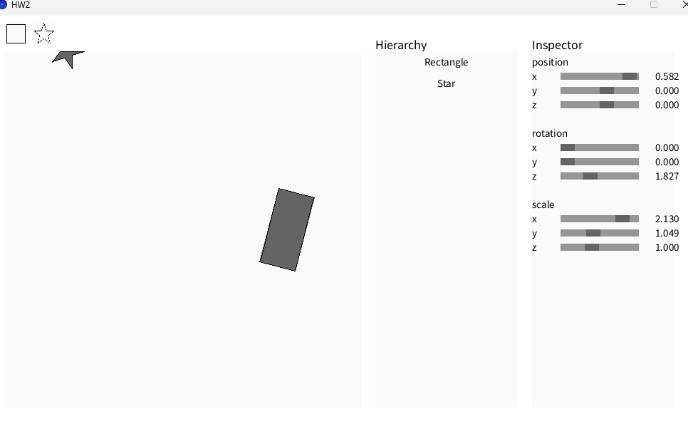

# Computer Graphics - Lab 2  
### 2D Rasterization Engine  
**Student Name:** [Your Name]  
**Student ID:** [Your Student ID]  
**University:** [NCU or NYCU]  
**Lab Due Date:** 2024/11/11 (NCU) or 2024/11/14 (NYCU)

---

## ✅ Completed Tasks

| Task | Description | Status |
|------|--------------|--------|
| 1 | Translation Matrix (`Matrix4::makeTrans`) | ✅ Completed |
| 2 | Rotation Matrix - Z Axis (`Matrix4::makeRotZ`) | ✅ Completed |
| 3 | Scaling Matrix (`Matrix4::makeScale`) | ✅ Completed |
| 4 | Point-in-Polygon (`util::pnpoly`) | ✅ Completed |
| 5 | Find Bounding Box (`util::findBoundBox`) | ✅ Completed |
| 6 | Sutherland–Hodgman Polygon Clipping (`util::Sutherland_Hodgman_algorithm`) | ✅ Completed |
| Bonus | SSAA (Super Sampling Anti-Aliasing) | ❌ Not implemented |

---

## 🧩 Implementation Details

### 1. Translation Matrix
**File:** `Matrix4.cpp`  
**Function:** `Matrix4::makeTrans(Vector3 t)`

**Translation Formula:**
$$
T =   
\begin{bmatrix}
1 & 0 & 0 & t_x \\
0 & 1 & 0 & t_y \\
0 & 0 & 1 & t_z \\
0 & 0 & 0 & 1
\end{bmatrix}
$$


**Scalar Formula:**
$$
T =   
\begin{bmatrix}
s_x & 0 & 0 & 0\\
0 & s_y & 0 & 0\\
0 & 0 & s_z & 0\\
0 & 0 & 0 & 1
\end{bmatrix}
$$
**Rotation Formula:**
$$
T =   
\begin{bmatrix}
cos(a) & -sin(a) & 0 & 0\\
sin(a) & cos(a) & 0 & 0\\
0 & 0 & s_z & 0\\
0 & 0 & 0 & 1
\end{bmatrix}
$$
**pnpoly:**  
```java
boolean pnpoly(float x, float y, Vector3[] vertexes) {  
    // TODO HW2 
    // You need to check the coordinate p(x,v) if inside the vertices.   
    // If yes return true, vice versa.
    int count = 0;  
    int n = vertexes.length;  
    for(int i = 0; i< n;  i++){  
        Vector3 p1, p2;
        p1  =  vertexes[i];  
        p2 = vertexes[(i+1)%n];  
        if((y<  p1.y) != (y<p2.y)){
          float decision = ( (y - p1.y) * (p2.x - p1.x) ) / (p2.y - p1.y) + p1.x;
          if(x  < decision){
            count ++;
          }
        }
    }  
    return count%2 ==1;
}
//basically just check if a point crosses the polygon odd times or even times
```
**FindBoundingBox:** 
***codeSnippets:***  
```java
public Vector3[] findBoundBox(Vector3[] v) {
    
    
    // TODO HW2 
    // You need to find the bounding box of the vertices v.
    // r1 -------
    //   |   /\  |
    //   |  /  \ |
    //   | /____\|
    //    ------- r2

    Vector3 recordminV = new Vector3(0);
    Vector3 recordmaxV = new Vector3(999);
    float minX, minY, minZ;
    float maxX, maxY, maxZ;
    minX = minY = minZ = Float.MIN_VALUE;
    maxX = maxY = maxZ  = Float.MAX_VALUE;
    for(Vector3 vec : v){
      minX = min(vec.x, minX);
      minY = min(vec.y, minY);
      minZ = min(vec.z,  minZ);
      maxX = max(vec.x, maxX);
      maxY = max(vec.y, maxY);
      maxZ = max(vec.z, maxZ);
      
    }
    
    Vector3[] result = { recordminV, recordmaxV };
    return result;
}
```
**Sutherland–Hodgman Polygon Clipping:**  
***codeSnippets:***
```java
public Vector3[] Sutherland_Hodgman_algorithm(Vector3[] points, Vector3[] boundary) {
    ArrayList<Vector3> input = new ArrayList<Vector3>();
    ArrayList<Vector3> output = new ArrayList<Vector3>();
    for (int i = 0; i < points.length; i += 1) {
        input.add(points[i]);
    }
    
    // TODO HW2
    // You need to implement the Sutherland Hodgman Algorithm in this section.
    // The function you pass 2 parameter. One is the vertexes of the shape "points".
    // And the other is the vertices of the "boundary".
    // The output is the vertices of the polygon.
    int n  = points.length;
    int bn = boundary.length;
    for(int i = 0; i< bn; i++){
      Vector3 b1 = boundary[i];
      Vector3 b2 = boundary[(i+1)%bn];
      output.clear();
      n = input.size();
      for(int j =0; j< n;j++){
          Vector3 p1 = input.get(j);
          Vector3 p2 = input.get((j+1)%n);
          boolean p1Inside = inside(p1,  b1, b2);
          boolean p2Inside = inside(p2, b1, b2);
          if(p1Inside&& p2Inside){
            output.add(p2);
            
          }
          else if(p1Inside && !p2Inside){
            Vector3 inter = intersection(p1,p2,b1, b2);
            output.add(inter);
          }
          else if(!p1Inside && p2Inside){
            Vector3 inter = intersection(p1,p2,b1, b2);
            output.add(inter);
            output.add(p2);
          }
        
        
      }
      input = new ArrayList<Vector3>(output);
    }
    output = input;
    Vector3[] result = new Vector3[output.size()];
    for (int i = 0; i < result.length; i += 1) {
        result[i] = output.get(i);
    }
    
    return result;
}
```
**Screenshots:**  
