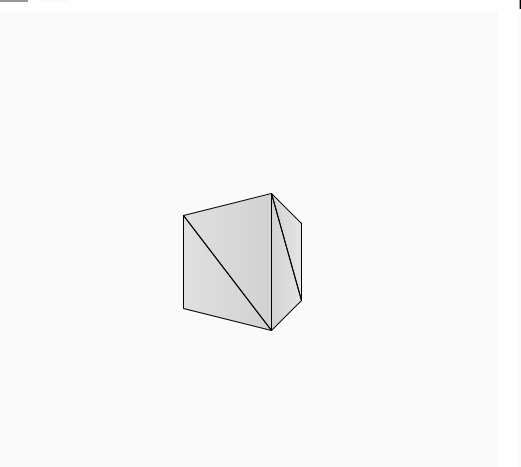
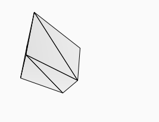
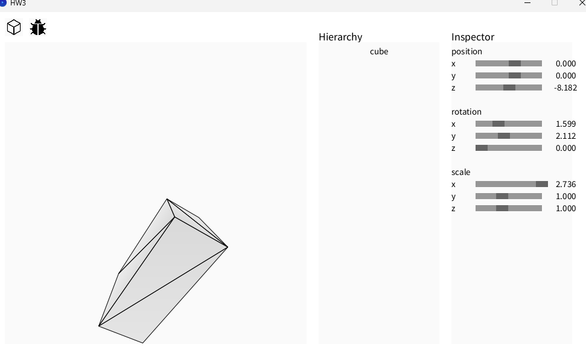

**Rotation  Matrices**  
A rotation by angle θ around the **y-axis** is:

$$
R_y(\theta) =
\begin{bmatrix}
\cos\theta & 0 & \sin\theta \\
0 & 1 & 0 \\
-\sin\theta & 0 & \cos\theta
\end{bmatrix}
$$
so if plugin to homogenous then it will be
$$ 
R_y(\theta) = 
\begin{bmatrix}
\cos\theta & 0 & \sin\theta & 0 \\
0 & 1 & 0 & 0\\
-\sin\theta & 0 & \cos\theta & 0 \\
0 & 0 & 0 & 1
\end{bmatrix}
$$
same for rotation around **x-axis** 
$$ 
R_x(\theta) = 
\begin{bmatrix}
1 & 0 & 0 & 0 \\
0 & \cos\theta & -\sin\theta & 0\\
0 & \sin\theta & \cos\theta & 0 \\
0 & 0 & 0 & 1
\end{bmatrix}
$$
**Model Transformation**  
To transform from local to world 
we first scale ,  then rotate ,  then translate.  
as for the rotation order,  since that the order of inversee is given, our order will be  as follow:
$$
Matrix = T*R_z(\omega)*R_x(\phi)*R_y(\theta)*S
$$
**View Matrix**  
To find the view matrix given camera position, we first align our direction from position to center of interest with z axis,
given the top of (0,1,0), we make it lie on our  yz plane 
such that our new x axis will be wordtop cross z,
and y axis will be x cross z
$$
\mathbf{z} = \frac{\mathbf{pos} - \mathbf{target}}
                {\|\mathbf{pos} - \mathbf{target}\|}
$$
$$
\mathbf{x} = \frac{\mathbf{up}_{world} \times \mathbf{z}}
                {\|\mathbf{up}_{world} \times \mathbf{z}\|}
$$
$$
\mathbf{y} = \mathbf{z} \times \mathbf{x}
$$
$$
V =
\begin{bmatrix}
x_x & x_y & x_z \\
y_x & y_y & y_z \\
z_x & z_y & z_z
\end{bmatrix}
$$
$$
T =
\begin{bmatrix}
1 & 0 & 0 & -pos_x \\
0 & 1 & 0 & -pos_y \\
0 & 0 & 1 & -pos_z \\
0 & 0 & 0 & 1
\end{bmatrix}
$$
$$
\text{View} = R \cdot T
$$

**Perspective-Matrix**  
$$
P =
\begin{bmatrix}
\frac{1}{k \cdot \text{aspect}} & 0 & 0 & 0 \\
0 & \frac{1}{k} & 0 & 0 \\
0 & 0 & -\frac{f+n}{f-n} & -\frac{2fn}{f-n} \\
0 & 0 & -1 & 0
\end{bmatrix}
$$

**get-Depth**  
plane equation has the form
$$
Ax + By + Cz + D = 0
$$
build 2 edge vector  
```java
Vector3 v0 = vertex[1].sub(vertex[0]);
Vector3 v1 = vertex[2].sub(vertex[0]);
```
compute cross product,  and return z
```java
Vector3 n = Vector3.cross(v0,v1);
float A = n.x;
float B = n.y;
float C = n.z;
float D = -(A * vertex[0].x + B * vertex[0].y + C * vertex[0].z);

return -(A*x + B*y + D) / C;
```

***Camera-Control***  (self explanatory?)
```java
void cameraControl(){
    // You can write your own camera control function here.
    // Use setPositionOrientation(Vector3 position,Vector3 lookat) to modify the ViewMatrix.
    // Hint : Use keyboard event and mouse click event to change the position of the camera
    if (keyPressed) {
    if (keyCode == UP) {
      cam_position.y--;
    } else if (keyCode == DOWN) {
      cam_position.y++;
    } else if (keyCode == LEFT) {
      cam_position.x--;
    } else if (keyCode == RIGHT) {
      cam_position.x++;
    }
  }
    main_camera.setPositionOrientation(cam_position, new Vector3(0,0,1));

}
```
***debug-Draw***
```java
Vector3 A = img_pos[0];
Vector3 B = img_pos[1];
Vector3 C = img_pos[2];

Vector3 AB = B.sub(A);
Vector3 AC = C.sub(A);

float crossZ = AB.x * AC.y - AB.y * AC.x;

// cull back faces (clockwise)
if (crossZ >= 0)
    continue;
```
if crossZ >= 0 dont  need to draw it 

screenShots



